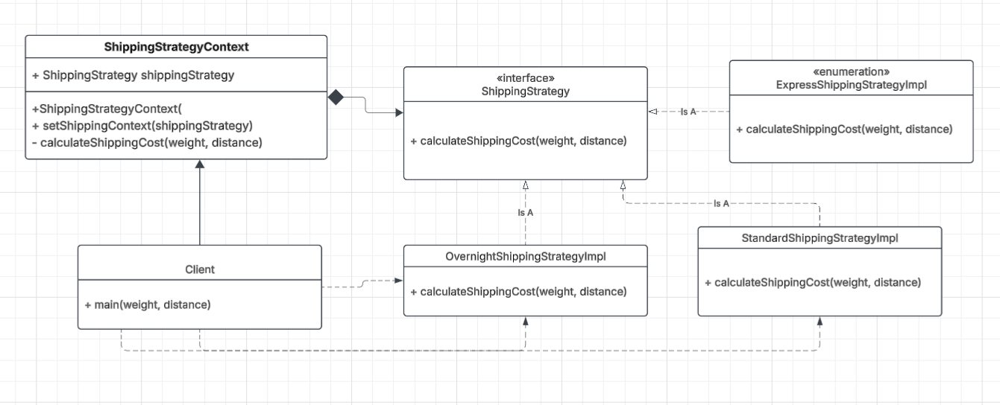

Requirements

 - Create a strategy interface for calculating shipping costs
 - Implement at least 3 concrete shipping strategies (e.g., standard, express, overnight)
 - Each strategy calculates cost based on weight and distance
 -Build a context class that uses a shipping strategy
 -Demonstrate swapping strategies at runtime
 

- Add handling for edge cases which needs a separate validator class before even reaching the strategy pattern  (zero weight, negative distance, international shipping)
- Implement at least one strategy with additional complexity (e.g., tiered pricing based on weight brackets)
- Strategy selection should be based on user input or business rules
- Calculate and display estimated delivery time alongside cost

 - Write a simple test that shows all 3 strategies producing different results for the same package
 

